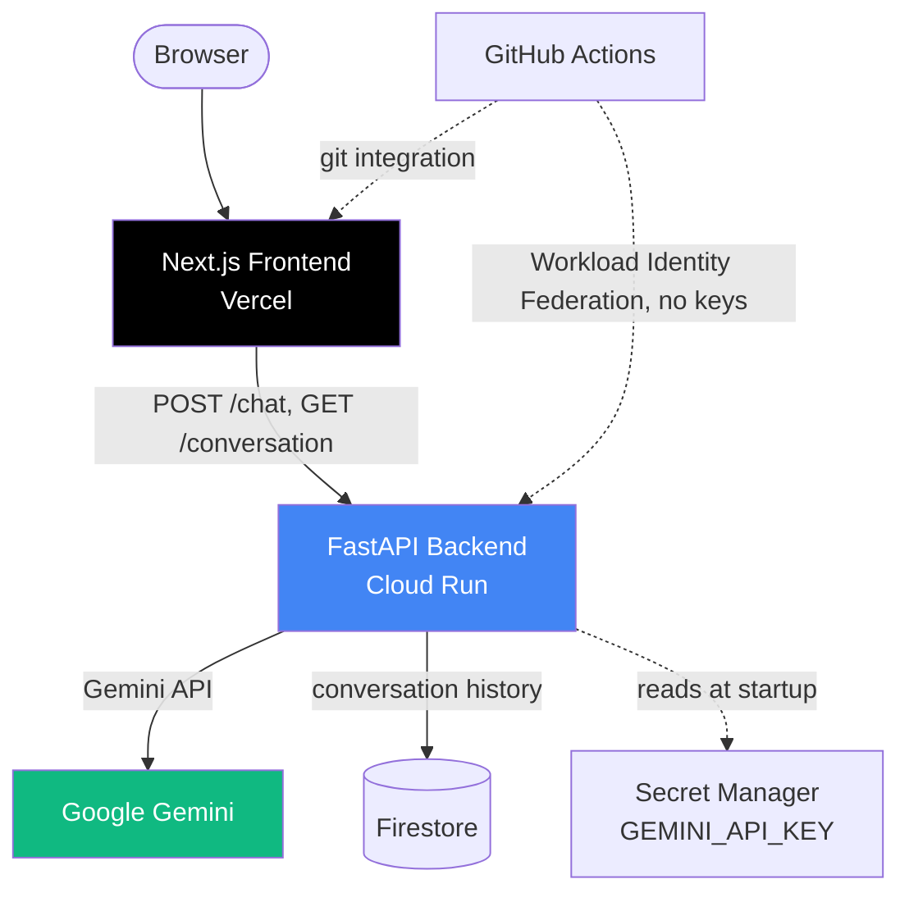

# 🤖 AI Digital Twin — Vercel + Cloud Run

A production-grade AI chatbot that acts as a personal digital twin, deployed on a free-tier, multi-cloud stack: **Vercel** for the frontend and **Google Cloud Run** for the backend, provisioned with Terraform and deployed via GitHub Actions.

This is a sibling project to `twin` (the AWS/Bedrock/Lambda version of the same app, in a separate repo) — same product, rebuilt on a different cloud to demonstrate the same architecture patterns (IaC, containerization, OIDC-based CI/CD) portably across providers.

## Architecture



A deliberately **monolith backend** — not split into microservices like the teaching-oriented `prodigon` repo — because a single-user chatbot doesn't need that complexity. What *is* borrowed from `prodigon`'s patterns: typed settings (`pydantic-settings`), a typed error hierarchy, route modules split by concern, and a real test suite.

## Project Structure

```
twin-gcp/
├── backend/
│   ├── app/
│   │   ├── main.py, config.py, errors.py, schemas.py, prompt.py
│   │   ├── routes/          # health.py, chat.py
│   │   └── services/        # gemini_client.py, memory_store.py
│   ├── data/                 # facts.json, style.txt, summary.txt
│   ├── tests/
│   ├── Dockerfile
│   └── pyproject.toml
├── frontend/                 # Next.js app (same UI as the AWS version)
├── infra/terraform/          # GCP (Cloud Run, Artifact Registry, Firestore,
│                              # Secret Manager, Workload Identity Federation)
│                              # + Vercel project (optional, via vercel_api_token)
└── .github/workflows/
    └── deploy-backend.yml    # test -> build -> push -> deploy to Cloud Run
```

## Local Development

**Backend:**
```bash
cd backend
uv venv .venv --python 3.12 && uv pip install -e ".[dev]" --python .venv/bin/python
cp .env.example .env   # set GEMINI_API_KEY
.venv/bin/uvicorn app.main:app --reload --port 8000
```

**Frontend:**
```bash
cd frontend
npm install
npm run dev   # reads .env.local -> NEXT_PUBLIC_API_URL=http://localhost:8000
```

Open http://localhost:3000.

## Tests

```bash
cd backend
.venv/bin/pytest   # Gemini client is mocked — no network/API key required
```

## Cloud Deployment

### GCP (backend)

```bash
cd infra/terraform
cp terraform.tfvars.example terraform.tfvars   # fill in project_id, gemini_api_key, github_repo
terraform init
terraform apply
```

This provisions: Artifact Registry, Cloud Run service (public), Firestore (native mode), a Secret Manager secret for `GEMINI_API_KEY`, a least-privilege runtime service account, and a GitHub Actions deploy service account trusted via **Workload Identity Federation** (no downloaded JSON key files).

After `apply`, set these in the GitHub repo (Settings → Secrets and variables → Actions):

| Type | Name | Value |
|------|------|-------|
| Variable | `GCP_PROJECT_ID` | `terraform output` project_id |
| Variable | `GCP_REGION` | e.g. `us-central1` |
| Secret | `GCP_WORKLOAD_IDENTITY_PROVIDER` | `terraform output workload_identity_provider` |
| Secret | `GCP_SERVICE_ACCOUNT` | `terraform output github_deployer_service_account` |

Pushing to `main` (touching `backend/**`) then builds, tests, and deploys automatically.

### Vercel (frontend)

```bash
cd frontend
vercel link
vercel env add NEXT_PUBLIC_API_URL production   # Cloud Run URL from terraform output
vercel --prod
```

Or connect the GitHub repo in the Vercel dashboard for automatic deploys on push.

## Deliberate Scope Decisions

- **Single environment, not dev/test/prod.** The AWS version manages three Terraform workspaces; this is a single-maintainer personal project where that isn't proportionate.
- **Local Terraform state, not a remote GCS backend.** Same reasoning — a remote state bucket + locking is infrastructure the AWS repo needed for team/multi-env use that doesn't apply here.
- **Monolith backend, not microservices.** A single-user chatbot doesn't need a gateway/model/worker split.

## License

MIT — see [LICENSE](LICENSE) for terms.
